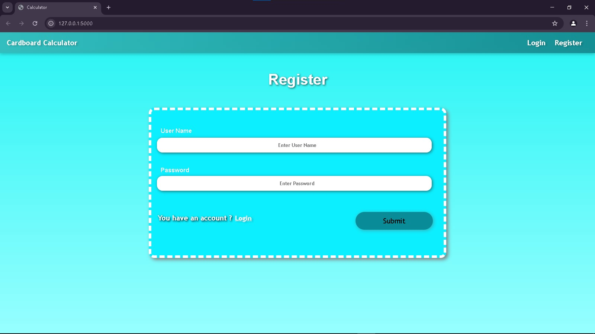
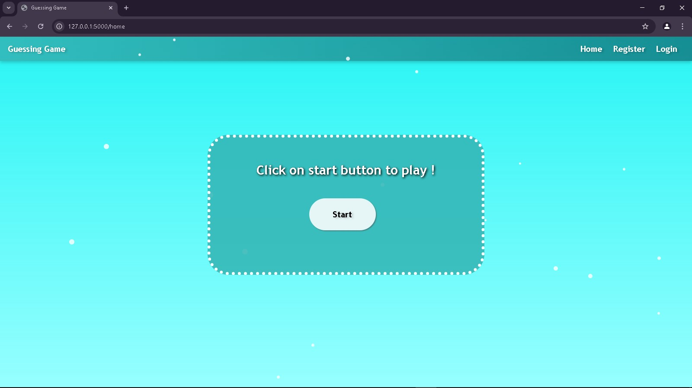
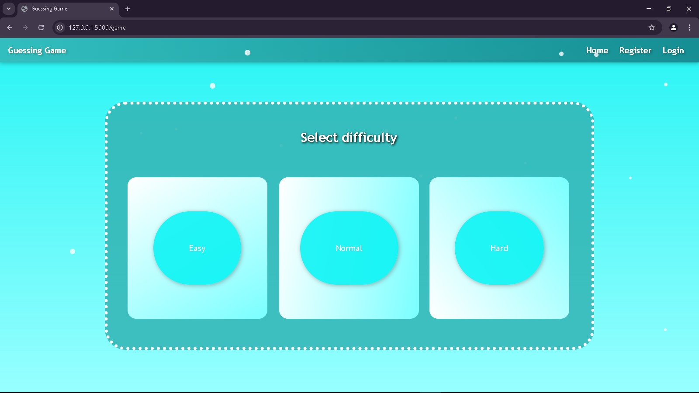
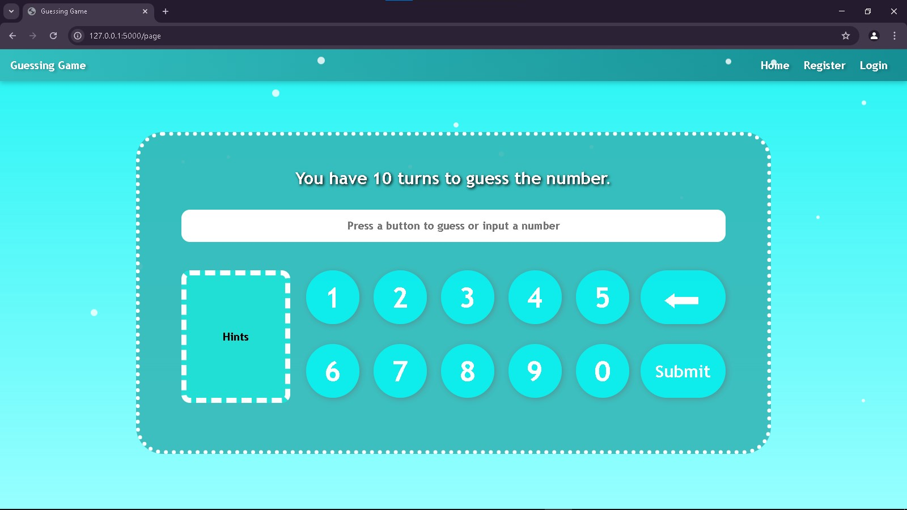
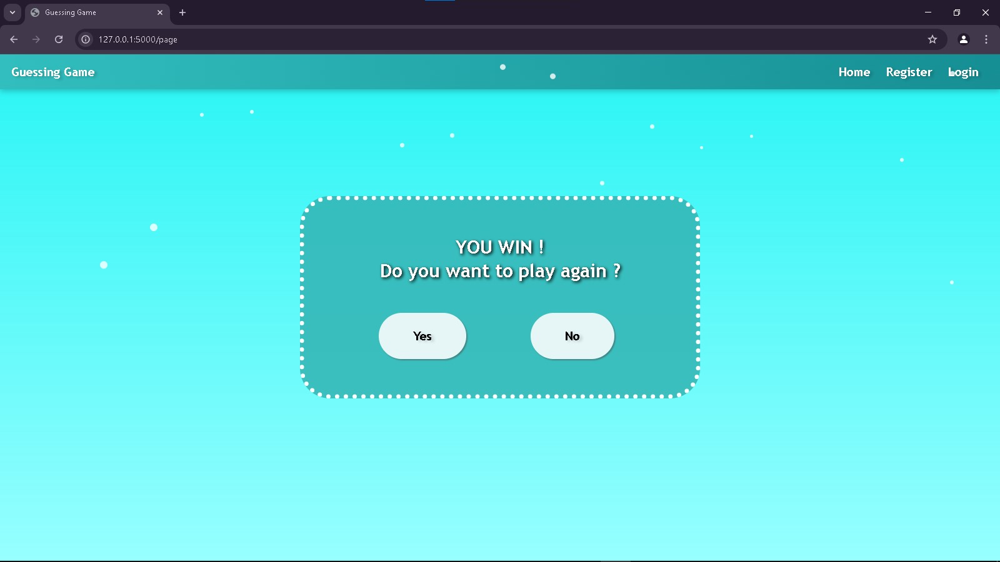
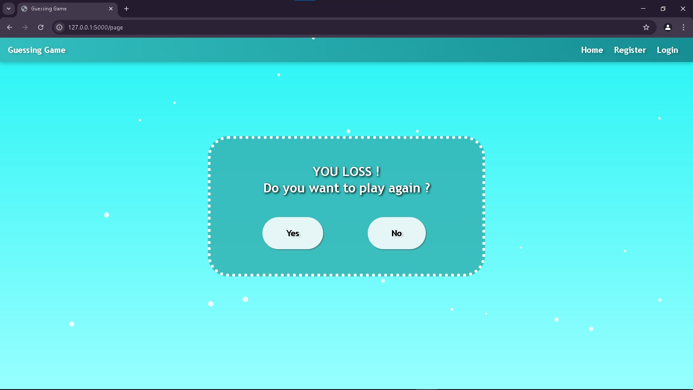

# Flask Number Guessing Game
## Overview
This is a simple number guessing game built using Python's Flask framework. Users can register and log in, with credentials stored in plain text files. Once logged in, players can choose from three difficulty levels (Easy, Normal, or Hard) that determine the range of the randomly generated number. The game then gives feedback—indicating if the guess is too high or too low—and limits the number of turns a player has to win.

## Features
* User Authentication: Register and log in with credentials stored in text files.<br>
* Difficulty Levels:<br>
        Easy: Guess a number between 1-10<br>
        Normal: Guess a number between 1-100<br>
        Hard: Guess a number between 1-1000<br>
* Turn-based Gameplay: Players have a set number of turns to guess the correct number.<br>
* Real-time Hints: Receive feedback if the guess is too high or too low.<br>
* Frontend: Built using HTML, CSS, and Jinja templating.<br>

## Installation
### Prerequisites
Python 3.x
Flask

## Setup
Clone the Repository:
```bash
git clone https://github.com/Mukhdoom-Hammad-khan/Guessing-Game.git
cd guessing-game
```

Create a Virtual Environment (Optional but Recommended):
```bash
python -m venv venv
source venv/bin/activate  # On Windows: venv\Scripts\activate
```

Install Dependencies:
```bash
pip install flask
```

Run the Application:
```bash
python app.py
```

Access the Application: 

Open your browser and navigate to http://127.0.0.1:5000.

## Usage
* Register: Create a new account using the registration form.<br>
* Login: Log in with your registered credentials.<br>
* Start the Game: Click on the "Start" button on the home page to select a difficulty level.<br>
* Play: Use the on-screen keypad to input your guess. The game will provide hints like "Guess Is Greater" or "Guess Is Lesser."<br>
* Game Outcome:<br>
        Win: If you guess the number correctly, a win screen is displayed.<br>
        Loss: If you run out of turns without guessing correctly, a loss screen is shown.<br>
        Play Again: Choose to restart the game from the win or loss screen.<br>

## Project Structure
```graphsql
guessing-game/
     │
     ├── screenshots&videos/
     │      ├── game.jpg
     │      ├── home.jpg
     │      ├── login.jpg
     │      ├── loss.jpg
     │      ├── page1.jpg
     │      ├── register.jpg
     │      ├── video.mp4
     │      └── win.jpg
     │ 
     ├── static/
     │      └── style.css
     │ 
     ├── templates/
     │      ├── base.html
     │      ├── game.html
     │      ├── index.html
     │      ├── login.html
     │      ├── loss.html
     │      ├── page1.html
     │      ├── register.html
     │      └── win.html
     │ 
     ├── LICENSE
     ├── README.md
     └── app.py
```
Note: Adjust the file paths for Name.txt and Password.txt according to your operating system if necessary.

## Technologies Used
* Flask: Python web framework.<br>
* Jinja2: Template engine for rendering HTML pages.<br>
* HTML & CSS: Frontend structure and styling.<br>
* Plain Text Files: Used to store user credentials (usernames and passwords).<br>

## Screenshots








## License
This project is licensed under the [MIT](LICENSE) License.

## Contact
For any questions or suggestions, please contact [hammadahmedopx@gmail.com].
